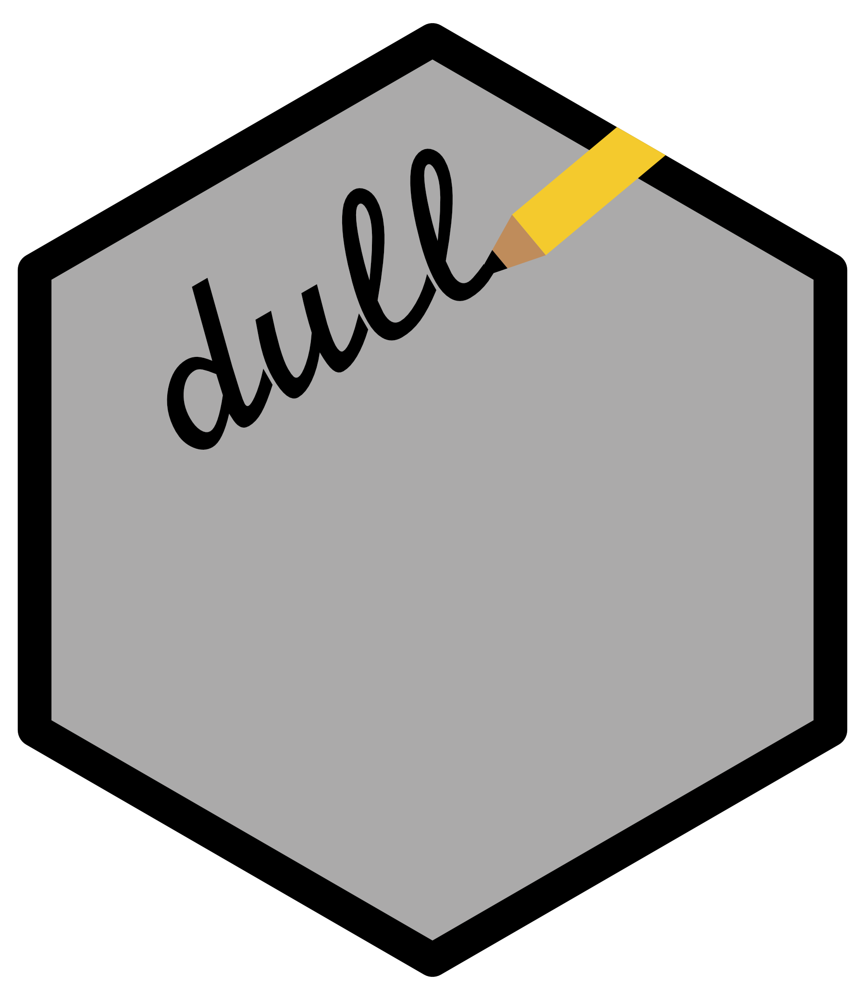

<h1 align="center">
	
</h1>

# dull
A light-weight web framework for R that makes building web applications a little too easy.

Below is the current style of creating dull apps, see further below for the upcoming style.
```R
dull() %>%
  get('^$', function(req, res) {
    res %>%
      body("I'm not a no-body") %>%
      send
  }) %>%
  put('^create/file/(?<path>\\w+)$', function(req, res) {
    file_path <- params(req)['path']
    
    if (file.exists(file_path)) {
      res %>%
        status(404) %>%
        send("Sorry, file already exists")
    } else {
      file.create(file_path)
      res %>%
        send("File created")
    }
  }) %>%
  listen('127.0.0.1', 3030)
```

The upcoming style of dull app building.
```R
dull()$
  get('^$', function(req, res) {
    res$status(200)
    res$send("I'm not a no-body")
  })$
  listen('127.0.0.1', 3030)
```

`dull()` returns a dull app object, specifically an R6 object, but you can also think of it as a list-like object. The methods of the application, request, and response objects are thus accessed with the "$". Note, this new style is still pipeable, for example
```R
res$status(200)
res$send("I'm not a no-body")
```
could have been written
```R
res$status(200)$send("I'm not a no-body")
```
This is possible because most response object methods invisibly return the response object.

I would love feedback. Rendering views is still in the works, so I realize it's difficult to create a powerful webserver at this point with dull. However, the code does work and can be installed via devtool's ```install_github``` function. Please let me know what you think of the style, if there are other web frameworks you would throw into the melting pot (see below for what's already stewing), and what you would like to be able to do with dull. To facilitate public discussion please tweet your questions at me (@ntweetor) or raise an issue here.

---

The server functionality and setup are primarily based on [expressjs](http://expressjs.com/). The syntactical styling is influenced by [wookie](http://wookie.lyonbros.com/). Additionally, the web frameworks [Sinatra](http://sinatrarb.com/), [Tornado](http://www.tornadoweb.org/en/stable/), [django](https://www.djangoproject.com/) and [Shiny](http://shiny.rstudio.com/) have also influenced the design of this project. They deserve this mention and more.

Hobey-ho, let's go!
